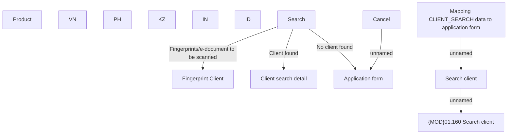

# Client search

- **Diagram Type**: Custom
- **Package**: HomerSelect/BSL/Analysis Model/Contract Origination/Fill in application/Client search/User Interface Model/Client search form
- **Diagram ID**: 139663
- **Elements**: 14
- **Connectors**: 6

