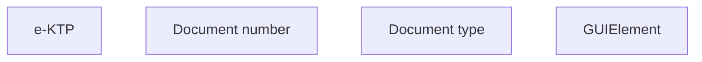

# ID

- **Diagram Type**: Custom
- **Package**: HomerSelect/BSL/Analysis Model/Contract Origination/Fill in application/Client search/User Interface Model/Client search form/ID
- **Diagram ID**: 139665
- **Elements**: 4
- **Connectors**: 0

