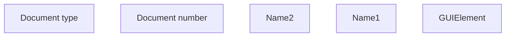

# Product

- **Diagram Type**: Custom
- **Package**: HomerSelect/BSL/Analysis Model/Contract Origination/Fill in application/Client search/User Interface Model/Client search form/Product
- **Diagram ID**: 133252
- **Elements**: 5
- **Connectors**: 0

