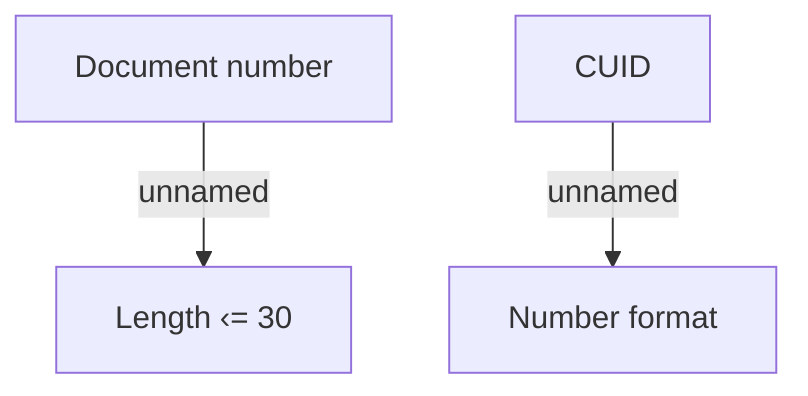

# Client search form - IN

- **Diagram Type**: Custom
- **Package**: HomerSelect/BSL/Analysis Model/Contract Origination/Fill in application/Client search/Validation rules/IN/Client search form - IN
- **Diagram ID**: 89098
- **Elements**: 4
- **Connectors**: 2

