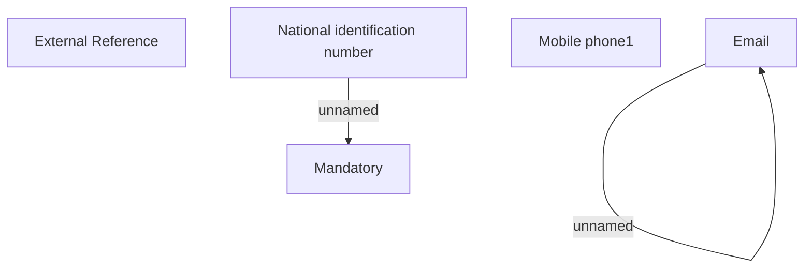

# Client search form - KZ

- **Diagram Type**: Custom
- **Package**: HomerSelect/BSL/Analysis Model/Contract Origination/Fill in application/Client search/Validation rules/KZ/Client search form - KZ
- **Diagram ID**: 123034
- **Elements**: 6
- **Connectors**: 2

