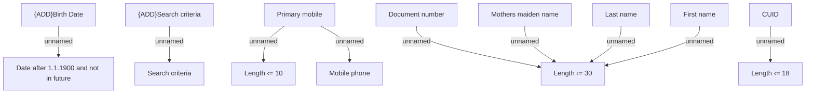

# Client search form - PH

```mermaid
graph TD
    ADD_Birth_Date["{ADD}Birth Date"]
    Date_after_1_1_1900_and_not_in_future["Date after 1.1.1900 and not in future"]
    Mobile_phone["Mobile phone"]
    Length_10["Length ‹= 10"]
    ADD_Search_criteria["{ADD}Search criteria"]
    Search_criteria["Search criteria"]
    Primary_mobile["Primary mobile"]
    Document_number["Document number"]
    Length_18["Length ‹= 18"]
    Length_30["Length ‹= 30"]
    Mothers_maiden_name["Mothers maiden name"]
    Last_name["Last name"]
    First_name["First name"]
    CUID["CUID"]
    ADD_Birth_Date -->|unnamed| Date_after_1_1_1900_and_not_in_future
    Document_number -->|unnamed| Length_30
    Mothers_maiden_name -->|unnamed| Length_30
    Last_name -->|unnamed| Length_30
    First_name -->|unnamed| Length_30
    CUID -->|unnamed| Length_18
    ADD_Search_criteria -->|unnamed| Search_criteria
    Primary_mobile -->|unnamed| Length_10
    Primary_mobile -->|unnamed| Mobile_phone
```
