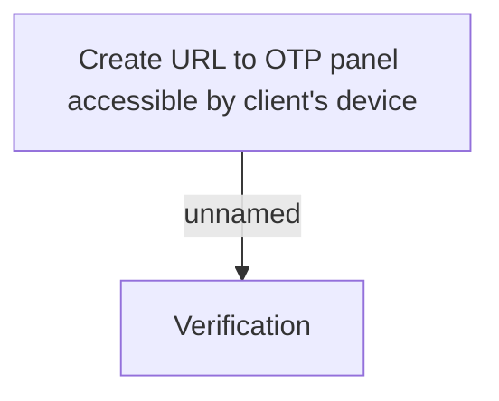

# Business Rules

- **Diagram Type**: Custom
- **Package**: HomerSelect/BSL/Analysis Model/Contract Origination/Fill in application/Consent verification/Business Rules
- **Diagram ID**: 132949
- **Elements**: 2
- **Connectors**: 1

