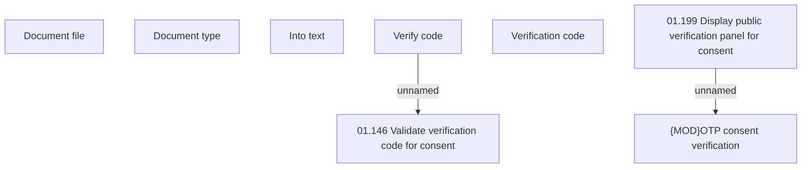

# Public verification panel

```mermaid
graph TD
    Document_file["Document file"]
    Document_type["Document type"]
    Into_text["Into text"]
    Verify_code["Verify code"]
    Verification_code["Verification code"]
    MOD_OTP_consent_verification["{MOD}OTP consent verification"]
    n_01_199_Display_public_verification_panel_for_consent["01.199 Display public verification panel for consent"]
    n_01_146_Validate_verification_code_for_consent["01.146 Validate verification code for consent"]
    Verify_code -->|unnamed| n_01_146_Validate_verification_code_for_consent
    n_01_199_Display_public_verification_panel_for_consent -->|unnamed| MOD_OTP_consent_verification
```
