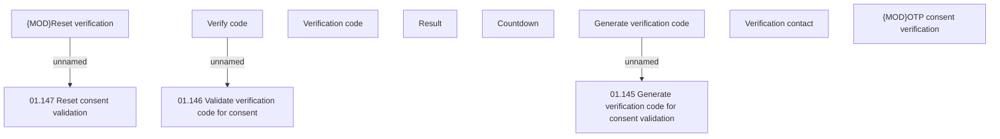

# Verification panel

- **Diagram Type**: Custom
- **Package**: HomerSelect/BSL/Analysis Model/Contract Origination/Fill in application/Consent verification/User Interface Model - Consent verification
- **Diagram ID**: 158048
- **Elements**: 11
- **Connectors**: 3

