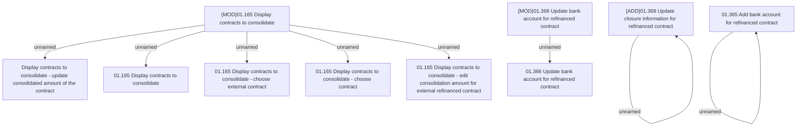

# Access rights

```mermaid
graph TD
    Display_contracts_to_consolidate_update_consolidated_amount_["Display contracts to consolidate - update consolidated amount of the contract"]
    ADD_01_368_Update_closure_information_for_refinanced_contrac["{ADD}01.368 Update closure information for refinanced contract"]
    ADD_01_368_Update_closure_information_for_refinanced_contrac["{ADD}01.368 Update closure information for refinanced contract"]
    n_01_165_Display_contracts_to_consolidate_edit_consolidation["01.165 Display contracts to consolidate - edit consolidation amount for external refinanced contract"]
    n_01_165_Display_contracts_to_consolidate_choose_external_co["01.165 Display contracts to consolidate - choose external contract"]
    MOD_01_366_Update_bank_account_for_refinanced_contract["{MOD}01.366 Update bank account for refinanced contract"]
    n_01_365_Add_bank_account_for_refinanced_contract["01.365 Add bank account for refinanced contract"]
    n_01_366_Update_bank_account_for_refinanced_contract["01.366 Update bank account for refinanced contract"]
    n_01_365_Add_bank_account_for_refinanced_contract["01.365 Add bank account for refinanced contract"]
    n_01_165_Display_contracts_to_consolidate_choose_contract["01.165 Display contracts to consolidate - choose contract"]
    n_01_165_Display_contracts_to_consolidate["01.165 Display contracts to consolidate"]
    MOD_01_165_Display_contracts_to_consolidate["{MOD}01.165 Display contracts to consolidate"]
    ADD_01_368_Update_closure_information_for_refinanced_contrac -->|unnamed| ADD_01_368_Update_closure_information_for_refinanced_contrac
    n_01_365_Add_bank_account_for_refinanced_contract -->|unnamed| n_01_365_Add_bank_account_for_refinanced_contract
    MOD_01_165_Display_contracts_to_consolidate -->|unnamed| Display_contracts_to_consolidate_update_consolidated_amount_
    MOD_01_165_Display_contracts_to_consolidate -->|unnamed| n_01_165_Display_contracts_to_consolidate
    MOD_01_165_Display_contracts_to_consolidate -->|unnamed| n_01_165_Display_contracts_to_consolidate_choose_external_co
    MOD_01_165_Display_contracts_to_consolidate -->|unnamed| n_01_165_Display_contracts_to_consolidate_choose_contract
    MOD_01_165_Display_contracts_to_consolidate -->|unnamed| n_01_165_Display_contracts_to_consolidate_edit_consolidation
    MOD_01_366_Update_bank_account_for_refinanced_contract -->|unnamed| n_01_366_Update_bank_account_for_refinanced_contract
```
