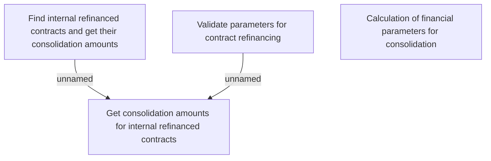

# Business Rules

```mermaid
graph TD
    Validate_parameters_for_contract_refinancing["Validate parameters for contract refinancing"]
    Find_internal_refinanced_contracts_and_get_their_consolidati["Find internal refinanced contracts and get their consolidation amounts"]
    Get_consolidation_amounts_for_internal_refinanced_contracts["Get consolidation amounts for internal refinanced contracts"]
    Calculation_of_financial_parameters_for_consolidation["Calculation of financial parameters for consolidation"]
    Find_internal_refinanced_contracts_and_get_their_consolidati -->|unnamed| Get_consolidation_amounts_for_internal_refinanced_contracts
    Validate_parameters_for_contract_refinancing -->|unnamed| Get_consolidation_amounts_for_internal_refinanced_contracts
```
