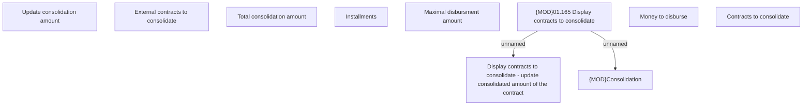

# Consolidation GUI

```mermaid
graph TD
    Display_contracts_to_consolidate_update_consolidated_amount_["Display contracts to consolidate - update consolidated amount of the contract"]
    Update_consolidation_amount["Update consolidation amount"]
    External_contracts_to_consolidate["External contracts to consolidate"]
    Total_consolidation_amount["Total consolidation amount"]
    Installments["Installments"]
    Maximal_disbursment_amount["Maximal disbursment amount"]
    MOD_01_165_Display_contracts_to_consolidate["{MOD}01.165 Display contracts to consolidate"]
    Money_to_disburse["Money to disburse"]
    Contracts_to_consolidate["Contracts to consolidate"]
    MOD_Consolidation["{MOD}Consolidation"]
    MOD_01_165_Display_contracts_to_consolidate -->|unnamed| Display_contracts_to_consolidate_update_consolidated_amount_
    MOD_01_165_Display_contracts_to_consolidate -->|unnamed| MOD_Consolidation
```
