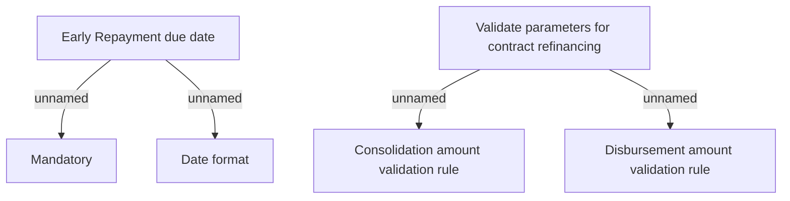

# Validations

```mermaid
graph TD
    Date_format["Date format"]
    Mandatory["Mandatory"]
    Early_Repayment_due_date["Early Repayment due date"]
    Validate_parameters_for_contract_refinancing["Validate parameters for contract refinancing"]
    Disbursement_amount_validation_rule["Disbursement amount validation rule"]
    Consolidation_amount_validation_rule["Consolidation amount validation rule"]
    Validate_parameters_for_contract_refinancing -->|unnamed| Consolidation_amount_validation_rule
    Validate_parameters_for_contract_refinancing -->|unnamed| Disbursement_amount_validation_rule
    Early_Repayment_due_date -->|unnamed| Mandatory
    Early_Repayment_due_date -->|unnamed| Date_format
```
