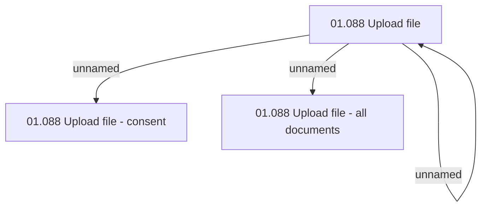

# File upload - access rights

- **Diagram Type**: Custom
- **Package**: HomerSelect/BSL/Analysis Model/Contract Origination/Fill in application/File upload/Access Rights
- **Diagram ID**: 121027
- **Elements**: 4
- **Connectors**: 3

