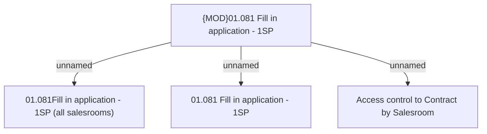

# Access Rights

- **Diagram Type**: Custom
- **Package**: HomerSelect/BSL/Analysis Model/Contract Origination/Fill in application/Fill in application - 1SP/Access Rights
- **Diagram ID**: 65907
- **Elements**: 4
- **Connectors**: 3

