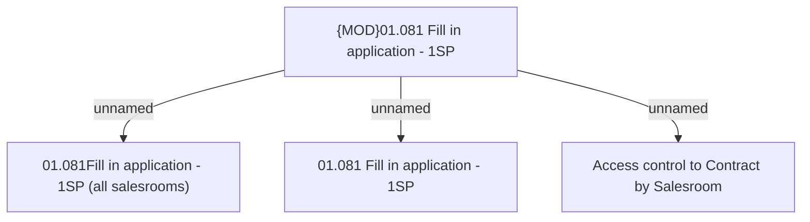

# Access Rights

```mermaid
graph TD
    n_01_081Fill_in_application_1SP_all_salesrooms["01.081Fill in application - 1SP (all salesrooms)"]
    n_01_081_Fill_in_application_1SP["01.081 Fill in application - 1SP"]
    Access_control_to_Contract_by_Salesroom["Access control to Contract by Salesroom"]
    MOD_01_081_Fill_in_application_1SP["{MOD}01.081 Fill in application - 1SP"]
    MOD_01_081_Fill_in_application_1SP -->|unnamed| n_01_081Fill_in_application_1SP_all_salesrooms
    MOD_01_081_Fill_in_application_1SP -->|unnamed| n_01_081_Fill_in_application_1SP
    MOD_01_081_Fill_in_application_1SP -->|unnamed| Access_control_to_Contract_by_Salesroom
```
