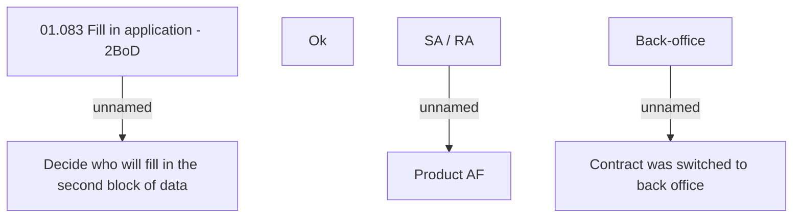

# 2BoD filling decision

- **Diagram Type**: Custom
- **Package**: HomerSelect/BSL/Analysis Model/Contract Origination/Fill in application/Fill in application - 2SP/User Interface Model
- **Diagram ID**: 42613
- **Elements**: 9
- **Connectors**: 3

