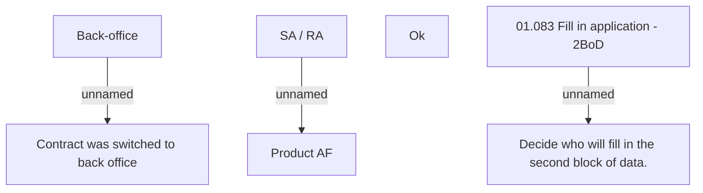

# 2BoD filling decision

```mermaid
graph TD
    Contract_was_switched_to_back_office["Contract was switched to back office"]
    Decide_who_will_fill_in_the_second_block_of_data["Decide who will fill in the second block of data"]
    Back_office["Back-office"]
    SA_RA["SA / RA"]
    Ok["Ok"]
    Decide_who_will_fill_in_the_second_block_of_data["Decide who will fill in the second block of data."]
    Contract_was_switched_to_back_office["Contract was switched to back office"]
    Product_AF["Product AF"]
    n_01_083_Fill_in_application_2BoD["01.083 Fill in application - 2BoD"]
    Back_office -->|unnamed| Contract_was_switched_to_back_office
    SA_RA -->|unnamed| Product_AF
    n_01_083_Fill_in_application_2BoD -->|unnamed| Decide_who_will_fill_in_the_second_block_of_data
```
