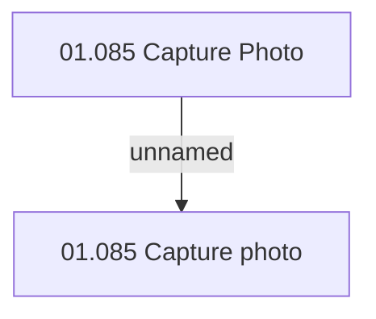

# Access Rights

- **Diagram Type**: Custom
- **Package**: HomerSelect/BSL/Analysis Model/Contract Origination/Fill in application/Photo component/Access Right
- **Diagram ID**: 145858
- **Elements**: 2
- **Connectors**: 1

