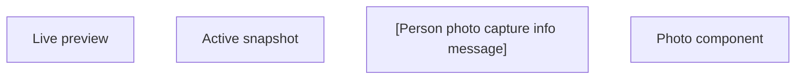

# Photo component (common panel)

- **Diagram Type**: Custom
- **Package**: HomerSelect/BSL/Analysis Model/Contract Origination/Fill in application/Photo component/User Interface Model/Photo component (common panel)
- **Diagram ID**: 132230
- **Elements**: 4
- **Connectors**: 0

