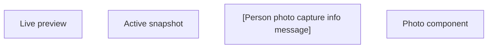

# Photo component (common panel)

```mermaid
graph TD
    Live_preview["Live preview"]
    Active_snapshot["Active snapshot"]
    Person_photo_capture_info_message["[Person photo capture info message]"]
    Photo_component["Photo component"]
```
