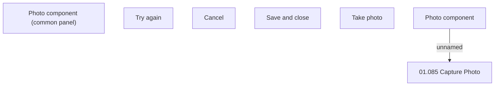

# Photo component

- **Diagram Type**: Custom
- **Package**: HomerSelect/BSL/Analysis Model/Contract Origination/Fill in application/Photo component/User Interface Model/Photo component
- **Diagram ID**: 132229
- **Elements**: 7
- **Connectors**: 1

