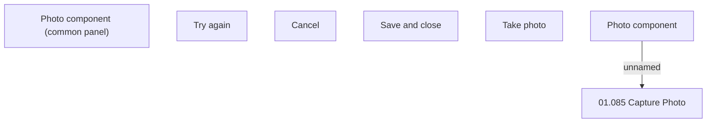

# Photo component

```mermaid
graph TD
    Photo_component_common_panel["Photo component (common panel)"]
    Try_again["Try again"]
    Cancel["Cancel"]
    n_01_085_Capture_Photo["01.085 Capture Photo"]
    Save_and_close["Save and close"]
    Take_photo["Take photo"]
    Photo_component["Photo component"]
    Photo_component -->|unnamed| n_01_085_Capture_Photo
```
