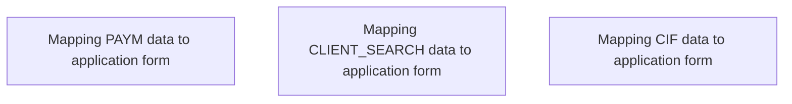

# Business Rules

- **Diagram Type**: Custom
- **Package**: HomerSelect/BSL/Analysis Model/Contract Origination/Fill in application/Prefill application/Business Rules
- **Diagram ID**: 150083
- **Elements**: 3
- **Connectors**: 0

