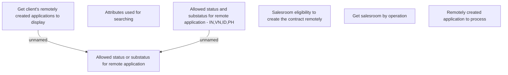

# Business rules

- **Diagram Type**: Custom
- **Package**: HomerSelect/BSL/Analysis Model/Contract Origination/Fill in application/Remotely filling/Business rules
- **Diagram ID**: 147697
- **Elements**: 7
- **Connectors**: 2

