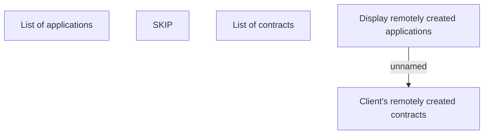

# Remotely created contracts

- **Diagram Type**: Custom
- **Package**: HomerSelect/BSL/Analysis Model/Contract Origination/Fill in application/Remotely filling/User Interface Model
- **Diagram ID**: 147640
- **Elements**: 5
- **Connectors**: 1

