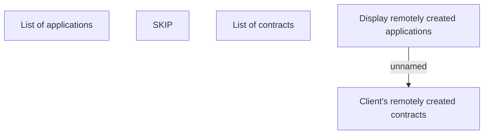

# Remotely created contracts

```mermaid
graph TD
    List_of_applications["List of applications"]
    SKIP["SKIP"]
    List_of_contracts["List of contracts"]
    Display_remotely_created_applications["Display remotely created applications"]
    Client_s_remotely_created_contracts["Client's remotely created contracts"]
    Display_remotely_created_applications -->|unnamed| Client_s_remotely_created_contracts
```
