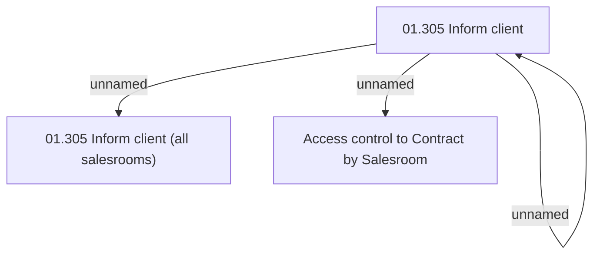

# Access Rights

```mermaid
graph TD
    n_01_305_Inform_client_all_salesrooms["01.305 Inform client (all salesrooms)"]
    n_01_305_Inform_client["01.305 Inform client"]
    Access_control_to_Contract_by_Salesroom["Access control to Contract by Salesroom"]
    n_01_305_Inform_client["01.305 Inform client"]
    n_01_305_Inform_client -->|unnamed| n_01_305_Inform_client
    n_01_305_Inform_client -->|unnamed| n_01_305_Inform_client_all_salesrooms
    n_01_305_Inform_client -->|unnamed| Access_control_to_Contract_by_Salesroom
```
