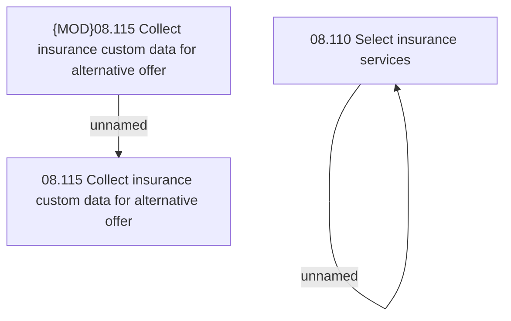

# Access Rights

```mermaid
graph TD
    n_08_115_Collect_insurance_custom_data_for_alternative_offer["08.115 Collect insurance custom data for alternative offer"]
    MOD_08_115_Collect_insurance_custom_data_for_alternative_off["{MOD}08.115 Collect insurance custom data for alternative offer"]
    n_08_110_Select_insurance_services["08.110 Select insurance services"]
    n_08_110_Select_insurance_services["08.110 Select insurance services"]
    MOD_08_115_Collect_insurance_custom_data_for_alternative_off -->|unnamed| n_08_115_Collect_insurance_custom_data_for_alternative_offer
    n_08_110_Select_insurance_services -->|unnamed| n_08_110_Select_insurance_services
```
