# Business Rules

- **Diagram Type**: Custom
- **Package**: HomerSelect/BSL/Analysis Model/Contract Origination/Insurance and Service Origination/Business Rules
- **Diagram ID**: 146668
- **Elements**: 16
- **Connectors**: 5

```mermaid
graph TD
    Service_with_qualification_criteria_allowed["Service with qualification criteria allowed"]
    Determine_next_insurance_period["Determine next insurance period"]
    Length_255["Length ‹= 255"]
    Insurance_evaluation_Eligible_Insurance_Service["Insurance evaluation : Eligible Insurance Service"]
    Prepare_Services_for_Selection["Prepare Services for Selection"]
    Length_40["Length ‹= 40"]
    Custom_Data_Code["Custom Data Code"]
    Custom_Data_Value["Custom Data Value"]
    Determine_first_insurance_period["Determine first insurance period"]
    Max_Loan_Amount["Max Loan Amount"]
    Eligible_profession["Eligible profession"]
    Eligible_CommodityType["Eligible CommodityType"]
    Maximum_sum_insured_client["Maximum sum insured - client"]
    Maximum_sum_insured_contract["Maximum sum insured - contract"]
    Minimum_client_s_age["Minimum client's age"]
    Maximum_client_s_age["Maximum client's age"]
    Custom_Data_Code -->|unnamed| Length_40
    Custom_Data_Value -->|unnamed| Length_255
    Prepare_Services_for_Selection -->|unnamed| Service_with_qualification_criteria_allowed
    Maximum_client_s_age -->|unnamed| Determine_first_insurance_period
    Maximum_client_s_age -->|unnamed| Determine_next_insurance_period
```

