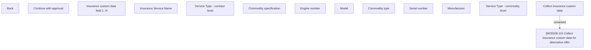

# Collect insurance custom data

```mermaid
graph TD
    MOD_08_115_Collect_insurance_custom_data_for_alternative_off["{MOD}08.115 Collect insurance custom data for alternative offer"]
    Back["Back"]
    Continue_with_approval["Continue with approval"]
    Insurance_custom_data_field_1_N["Insurance custom data field 1..N"]
    Insurance_Service_Name["Insurance Service Name"]
    Service_Type_contract_level["Service Type - contract level"]
    Insurance_custom_data_field_1_N["Insurance custom data field 1..N"]
    Insurance_Service_Name["Insurance Service Name"]
    Commodity_specification["Commodity specification"]
    Engine_number["Engine number"]
    Model["Model"]
    Commodity_type["Commodity type"]
    Serial_number["Serial number"]
    Manufacturer["Manufacturer"]
    Service_Type_commodity_level["Service Type - commodity level"]
    Collect_insurance_custom_data["Collect insurance custom data"]
    Collect_insurance_custom_data -->|unnamed| MOD_08_115_Collect_insurance_custom_data_for_alternative_off
```
