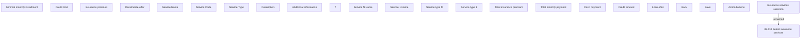

# Insurance services selection

```mermaid
graph TD
    Minimal_monthly_installment["Minimal monthly installment"]
    Credit_limit["Credit limit"]
    Insurance_premium["Insurance premium"]
    n_08_110_Select_insurance_services["08.110 Select insurance services"]
    Recalculate_offer["Recalculate offer"]
    Service_Name["Service Name"]
    Service_Code["Service Code"]
    Service_Type["Service Type"]
    Description["Description"]
    Additional_information["Additional information"]
    n_["!!!"]
    n_["!!!"]
    n_["?"]
    n_["?"]
    Service_N_Name["Service N Name"]
    Service_1_Name["Service 1 Name"]
    Service_type_M["Service type M"]
    n_["!!!"]
    n_["!!!"]
    n_["?"]
    n_["?"]
    Service_N_Name["Service N Name"]
    Service_1_Name["Service 1 Name"]
    Service_type_1["Service type 1"]
    Total_insurance_premium["Total insurance premium"]
    Total_monthly_payment["Total monthly payment"]
    Cash_payment["Cash payment"]
    Credit_amount["Credit amount"]
    Loan_offer["Loan offer"]
    Back["Back"]
    Save["Save"]
    Action_buttons["Action buttons"]
    Insurance_services_selection["Insurance services selection"]
    Insurance_services_selection -->|unnamed| n_08_110_Select_insurance_services
```
