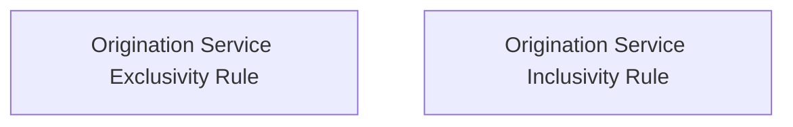

# Validation rules

- **Diagram Type**: Custom
- **Package**: HomerSelect/BSL/Analysis Model/Contract Origination/Insurance and Service Origination/Validation rules
- **Diagram ID**: 139684
- **Elements**: 2
- **Connectors**: 0

