# Access Rights

- **Diagram Type**: Custom
- **Package**: HomerSelect/BSL/Analysis Model/Contract Origination/Interface to external system (eshop)/Contract origination/Application Payment Channel Management/Access Rights
- **Diagram ID**: 129722
- **Elements**: 16
- **Connectors**: 10

```mermaid
graph TD
    n_01_465_Set_payment_channel_all_applications["01.465 Set payment channel - all applications"]
    n_01_465_Set_payment_channel["01.465 Set payment channel"]
    MOD_01_465_Set_payment_channel["{MOD}01.465 Set payment channel"]
    n_01_460_Create_DDM_externally["01.460 Create DDM externally"]
    n_01_464_Get_payment_channels["01.464 Get payment channels"]
    ADD_01_464_Get_payment_channels["{ADD}01.464 Get payment channels"]
    n_01_463_Change_repayment_channel_externally_all_application["01.463 Change repayment channel externally - all applications"]
    n_01_463_Change_repayment_channel_externally["01.463 Change repayment channel externally"]
    n_01_462_Get_DDM_by_application["01.462 Get DDM by application"]
    MOD_01_462_Get_DDM_by_application["{MOD}01.462 Get DDM by application"]
    n_01_461_Update_DDM_externally_all_applications["01.461 Update DDM externally - all applications"]
    n_01_461_Update_DDM_externally["01.461 Update DDM externally"]
    n_01_460_Create_DDM_externally_all_applications["01.460 Create DDM externally - all applications"]
    n_01_463_Change_repayment_channel_externally["01.463 Change repayment channel externally"]
    n_01_461_Update_DDM_externally["01.461 Update DDM externally"]
    MOD_01_460_Create_DDM_externally["{MOD}01.460 Create DDM externally"]
    n_01_464_Get_payment_channels -->|unnamed| ADD_01_464_Get_payment_channels
    MOD_01_460_Create_DDM_externally -->|unnamed| n_01_460_Create_DDM_externally_all_applications
    MOD_01_460_Create_DDM_externally -->|unnamed| n_01_460_Create_DDM_externally
    n_01_461_Update_DDM_externally -->|unnamed| n_01_461_Update_DDM_externally_all_applications
    n_01_461_Update_DDM_externally -->|unnamed| n_01_461_Update_DDM_externally
    n_01_463_Change_repayment_channel_externally -->|unnamed| n_01_463_Change_repayment_channel_externally
    n_01_463_Change_repayment_channel_externally -->|unnamed| n_01_463_Change_repayment_channel_externally_all_application
    MOD_01_465_Set_payment_channel -->|unnamed| n_01_465_Set_payment_channel_all_applications
    MOD_01_465_Set_payment_channel -->|unnamed| n_01_465_Set_payment_channel
    MOD_01_462_Get_DDM_by_application -->|unnamed| n_01_462_Get_DDM_by_application
```

