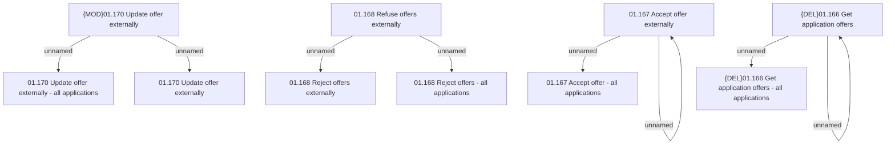

# Access Rights

```mermaid
graph TD
    n_01_170_Update_offer_externally_all_applications["01.170 Update offer externally - all applications"]
    n_01_170_Update_offer_externally["01.170 Update offer externally"]
    MOD_01_170_Update_offer_externally["{MOD}01.170 Update offer externally"]
    n_01_167_Accept_offer_all_applications["01.167 Accept offer - all applications"]
    n_01_168_Reject_offers_all_applications["01.168 Reject offers - all applications"]
    DEL_01_166_Get_application_offers_all_applications["{DEL}01.166 Get application offers - all applications"]
    n_01_168_Reject_offers_externally["01.168 Reject offers externally"]
    n_01_167_Accept_offer_externally["01.167 Accept offer externally"]
    DEL_01_166_Get_application_offers["{DEL}01.166 Get application offers"]
    n_01_168_Refuse_offers_externally["01.168 Refuse offers externally"]
    DEL_01_166_Get_application_offers["{DEL}01.166 Get application offers"]
    n_01_167_Accept_offer_externally["01.167 Accept offer externally"]
    n_01_167_Accept_offer_externally -->|unnamed| n_01_167_Accept_offer_all_applications
    n_01_167_Accept_offer_externally -->|unnamed| n_01_167_Accept_offer_externally
    n_01_168_Refuse_offers_externally -->|unnamed| n_01_168_Reject_offers_externally
    n_01_168_Refuse_offers_externally -->|unnamed| n_01_168_Reject_offers_all_applications
    MOD_01_170_Update_offer_externally -->|unnamed| n_01_170_Update_offer_externally_all_applications
    MOD_01_170_Update_offer_externally -->|unnamed| n_01_170_Update_offer_externally
    DEL_01_166_Get_application_offers -->|unnamed| DEL_01_166_Get_application_offers_all_applications
    DEL_01_166_Get_application_offers -->|unnamed| DEL_01_166_Get_application_offers
```
