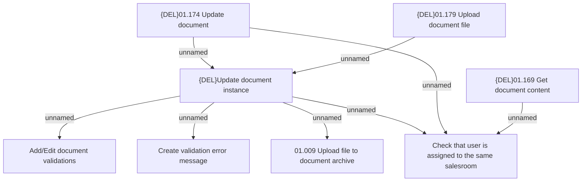

# Business Rules

- **Diagram Type**: Custom
- **Package**: HomerSelect/BSL/Analysis Model/Contract Origination/Interface to external system (eshop)/Contract origination/Application Document Management/Business Rules
- **Diagram ID**: 157425
- **Elements**: 8
- **Connectors**: 8

