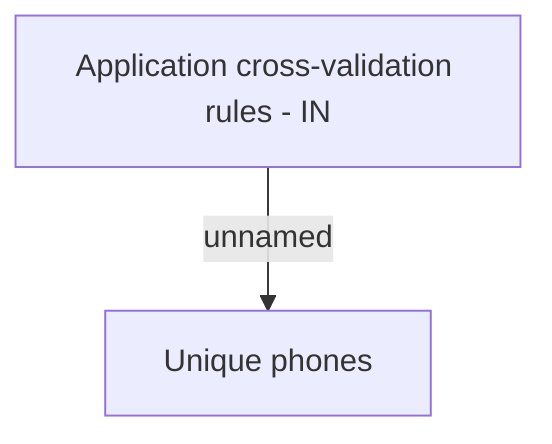

# Cross validations - IN

```mermaid
graph TD
    Unique_phones["Unique phones "]
    Application_cross_validation_rules_IN["Application cross-validation rules - IN"]
    Application_cross_validation_rules_IN -->|unnamed| Unique_phones
```
