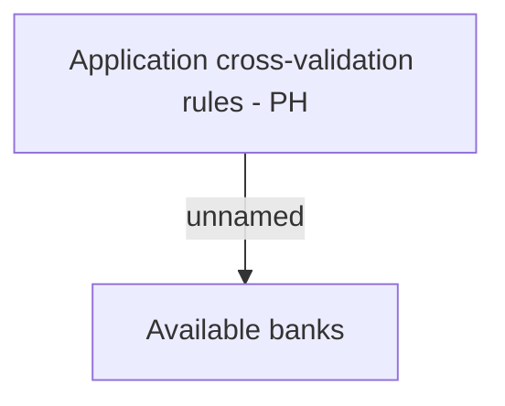

# Cross validations - PH

```mermaid
graph TD
    Application_cross_validation_rules_PH["Application cross-validation rules - PH"]
    Available_banks["Available banks"]
    Application_cross_validation_rules_PH -->|unnamed| Available_banks
```
