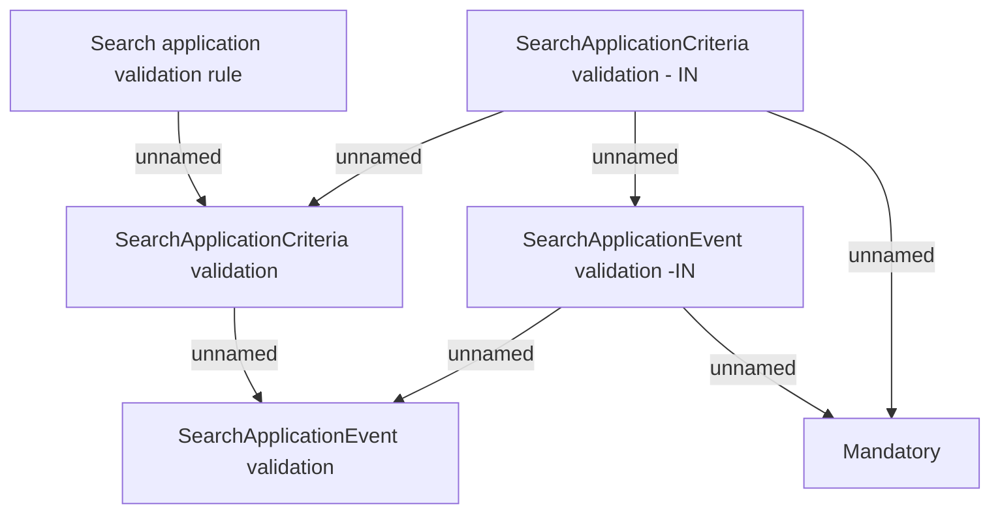

# Search Validation Rules

- **Diagram Type**: Custom
- **Package**: HomerSelect/BSL/Analysis Model/Contract Origination/Interface to external system (eshop)/Contract origination/Application Management/Validation Rules
- **Diagram ID**: 153785
- **Elements**: 6
- **Connectors**: 7

