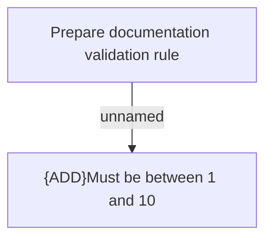

# Validation Rules For Prepare documentation

```mermaid
graph TD
    ADD_Must_be_between_1_and_10["{ADD}Must be between 1 and 10"]
    Prepare_documentation_validation_rule["Prepare documentation validation rule"]
    Prepare_documentation_validation_rule -->|unnamed| ADD_Must_be_between_1_and_10
```
