# Validation rules - PH

- **Diagram Type**: Custom
- **Package**: HomerSelect/BSL/Analysis Model/Contract Origination/Interface to external system (eshop)/Contract origination/Application Management/Validation Rules/PH
- **Diagram ID**: 149992
- **Elements**: 44
- **Connectors**: 52

```mermaid
graph TD
    Length_50["Length 50"]
    Length_90["Length 90"]
    Remittance_Data_validation_rule["Remittance Data validation rule"]
    Total_number_of_related_persons["Total number of related persons"]
    Length_30["Length ‹= 30"]
    Allowed_characters_extended_set["Allowed characters (extended set)"]
    Length_255["Length 255"]
    Alphanumeric_character_set["Alphanumeric character set"]
    Max_length_40["Max length 40"]
    Commodity_validation_rule_PH["Commodity validation rule-PH"]
    n_1_28["1-28"]
    Financial_amount_0["Financial amount ›= 0"]
    Max_length_60["Max length 60"]
    ASCII_32_to_ASCII_126["ASCII 32 to ASCII 126"]
    Employment_validation_rule_PH["Employment validation rule-PH"]
    Payment_provider_validation["Payment provider validation"]
    Account_holder_name_length["Account holder name length"]
    Account_number_validation["Account number validation"]
    Account_number_format["Account number format"]
    Account_number_length["Account number length"]
    PaymentChannel_validation_rule_PH["PaymentChannel validation rule-PH"]
    Remitter_s_phone_format["Remitter's phone format"]
    Length_8_20["Length 8-20"]
    General_phone_number["General phone number"]
    Person_validation_rule_PH["Person validation rule-PH"]
    Number_of_dependents["Number of dependents"]
    Zip_code_format["Zip code format"]
    Allowed_characters["Allowed characters"]
    Double_space_forbidden["Double space forbidden"]
    Address_validation_rule_PH["Address validation rule - PH"]
    ClientAddress_validation_rule_PH["ClientAddress validation rule - PH"]
    Extended_text_character_set["Extended text character set"]
    Max_8_elements["Max 8 elements"]
    Max_length_50["Max length 50"]
    E_mail_format["E-mail format"]
    Land_phone_number["Land phone number"]
    Mobile_phone["Mobile phone"]
    Contact_validation_rule_PH["Contact validation rule-PH"]
    Unique_client_phones["Unique client phones"]
    Person_age["Person age"]
    Cannot_be_in_future["Cannot be in future"]
    Nickname_character_set["Nickname character set"]
    Name_character_set["Name character set"]
    MOD_Application_validation_rule_PH["{MOD}Application validation rule-PH"]
    PaymentChannel_validation_rule_PH -->|unnamed| Account_holder_name_length
    Remittance_Data_validation_rule -->|unnamed| Financial_amount_0
    Address_validation_rule_PH -->|unnamed| Length_50
    Address_validation_rule_PH -->|unnamed| Double_space_forbidden
    Address_validation_rule_PH -->|unnamed| Length_90
    Address_validation_rule_PH -->|unnamed| Allowed_characters_extended_set
    Address_validation_rule_PH -->|unnamed| Length_255
    Zip_code_format -->|unnamed| Address_validation_rule_PH
    Person_validation_rule_PH -->|unnamed| Remittance_Data_validation_rule
    Person_validation_rule_PH -->|unnamed| Name_character_set
    Person_validation_rule_PH -->|unnamed| Length_30
    ClientAddress_validation_rule_PH -->|unnamed| Address_validation_rule_PH
    PaymentChannel_validation_rule_PH -->|unnamed| Account_number_validation
    Contact_validation_rule_PH -->|unnamed| Max_8_elements
    PaymentChannel_validation_rule_PH -->|unnamed| Account_number_length
    PaymentChannel_validation_rule_PH -->|unnamed| Account_number_format
    Employment_validation_rule_PH -->|unnamed| Address_validation_rule_PH
    Employment_validation_rule_PH -->|unnamed| ASCII_32_to_ASCII_126
    Employment_validation_rule_PH -->|unnamed| Max_length_60
    Employment_validation_rule_PH -->|unnamed| n_1_28
    Employment_validation_rule_PH -->|unnamed| Contact_validation_rule_PH
    Commodity_validation_rule_PH -->|unnamed| Max_length_50
    Commodity_validation_rule_PH -->|unnamed| Alphanumeric_character_set
    Commodity_validation_rule_PH -->|unnamed| ASCII_32_to_ASCII_126
    Commodity_validation_rule_PH -->|unnamed| Max_length_40
    PaymentChannel_validation_rule_PH -->|unnamed| Payment_provider_validation
    MOD_Application_validation_rule_PH -->|unnamed| Length_30
    MOD_Application_validation_rule_PH -->|unnamed| Length_255
    MOD_Application_validation_rule_PH -->|unnamed| Total_number_of_related_persons
    MOD_Application_validation_rule_PH -->|unnamed| ClientAddress_validation_rule_PH
    MOD_Application_validation_rule_PH -->|unnamed| Cannot_be_in_future
    MOD_Application_validation_rule_PH -->|unnamed| Number_of_dependents
    MOD_Application_validation_rule_PH -->|unnamed| Financial_amount_0
    MOD_Application_validation_rule_PH -->|unnamed| Employment_validation_rule_PH
    MOD_Application_validation_rule_PH -->|unnamed| Person_validation_rule_PH
    MOD_Application_validation_rule_PH -->|unnamed| Contact_validation_rule_PH
    MOD_Application_validation_rule_PH -->|unnamed| Commodity_validation_rule_PH
    Address_validation_rule_PH -->|unnamed| Allowed_characters
    MOD_Application_validation_rule_PH -->|unnamed| Nickname_character_set
    MOD_Application_validation_rule_PH -->|unnamed| Name_character_set
    MOD_Application_validation_rule_PH -->|unnamed| Alphanumeric_character_set
    MOD_Application_validation_rule_PH -->|unnamed| Person_age
    Contact_validation_rule_PH -->|unnamed| Remitter_s_phone_format
    Contact_validation_rule_PH -->|unnamed| Length_8_20
    Contact_validation_rule_PH -->|unnamed| Land_phone_number
    Contact_validation_rule_PH -->|unnamed| Unique_client_phones
    Contact_validation_rule_PH -->|unnamed| General_phone_number
    Contact_validation_rule_PH -->|unnamed| Extended_text_character_set
    Contact_validation_rule_PH -->|unnamed| Max_length_50
    Contact_validation_rule_PH -->|unnamed| E_mail_format
    Contact_validation_rule_PH -->|unnamed| Mobile_phone
    MOD_Application_validation_rule_PH -->|unnamed| PaymentChannel_validation_rule_PH
```

