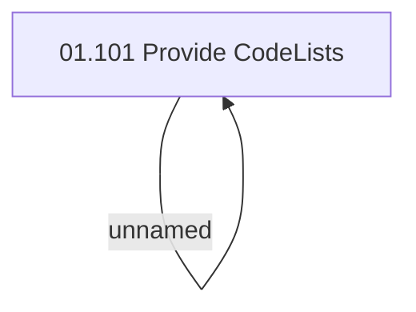

# Access Rights

- **Diagram Type**: Custom
- **Package**: HomerSelect/BSL/Analysis Model/Contract Origination/Interface to external system (eshop)/Contract origination/Enumeration Management/Access Rights
- **Diagram ID**: 95067
- **Elements**: 2
- **Connectors**: 1

