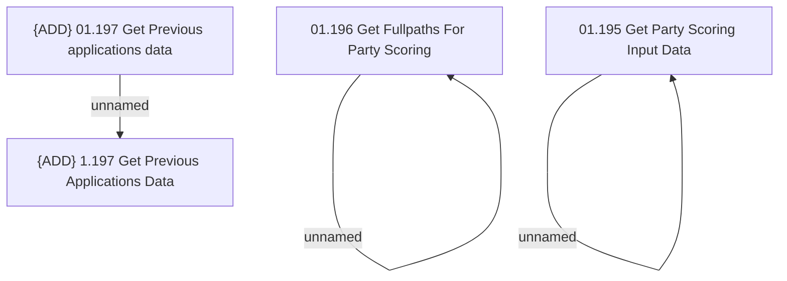

# Access Rights

- **Diagram Type**: Custom
- **Package**: HomerSelect/BSL/Analysis Model/Contract Origination/Interface to external system (eshop)/Contract origination/Party Scoring Input Data/Access Rights
- **Diagram ID**: 155723
- **Elements**: 6
- **Connectors**: 3

