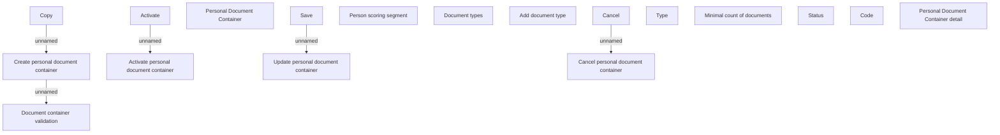

# Personal Document Container Detail

```mermaid
graph TD
    Document_container_validation["Document container validation"]
    Cancel["Cancel"]
    Activate["Activate"]
    Create_personal_document_container["Create personal document container"]
    Activate_personal_document_container["Activate personal document container"]
    Update_personal_document_container["Update personal document container"]
    Cancel_personal_document_container["Cancel personal document container"]
    Personal_Document_Container["Personal Document Container"]
    Copy["Copy"]
    Person_scoring_segment["Person scoring segment"]
    Document_types["Document types"]
    Add_document_type["Add document type"]
    Save["Save"]
    Type["Type"]
    Minimal_count_of_documents["Minimal count of documents"]
    Status["Status"]
    Code["Code"]
    Personal_Document_Container_detail["Personal Document Container detail"]
    Cancel -->|unnamed| Cancel_personal_document_container
    Save -->|unnamed| Update_personal_document_container
    Activate -->|unnamed| Activate_personal_document_container
    Copy -->|unnamed| Create_personal_document_container
    Create_personal_document_container -->|unnamed| Document_container_validation
```
