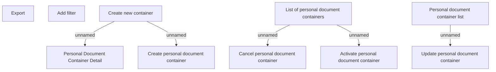

# Personal Document Container

```mermaid
graph TD
    Activate_personal_document_container["Activate personal document container"]
    Export["Export"]
    Add_filter["Add filter"]
    Cancel_personal_document_container["Cancel personal document container"]
    Update_personal_document_container["Update personal document container"]
    Create_personal_document_container["Create personal document container"]
    Personal_Document_Container_Detail["Personal Document Container Detail"]
    Create_new_container["Create new container"]
    List_of_personal_document_containers["List of personal document containers"]
    Personal_document_container_list["Personal document container list"]
    Create_new_container -->|unnamed| Personal_Document_Container_Detail
    Create_new_container -->|unnamed| Create_personal_document_container
    Personal_document_container_list -->|unnamed| Update_personal_document_container
    List_of_personal_document_containers -->|unnamed| Cancel_personal_document_container
    List_of_personal_document_containers -->|unnamed| Activate_personal_document_container
```
