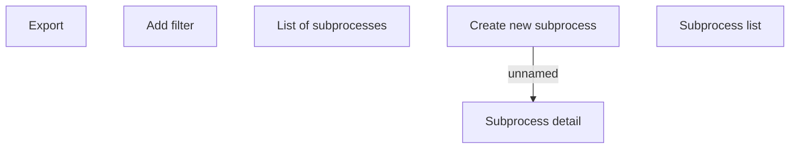

# Subprocess

- **Diagram Type**: Custom
- **Package**: HomerSelect/BSL/Analysis Model/Contract Origination/Loan origination configuration /User Interface Model/Subprocess
- **Diagram ID**: 124334
- **Elements**: 6
- **Connectors**: 1

