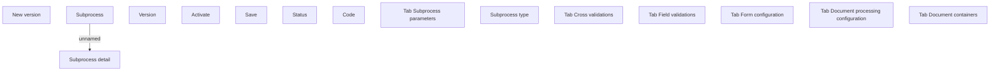

# Subprocess detail

- **Diagram Type**: Custom
- **Package**: HomerSelect/BSL/Analysis Model/Contract Origination/Loan origination configuration /User Interface Model/Subprocess/Subprocess detail
- **Diagram ID**: 124335
- **Elements**: 15
- **Connectors**: 1

