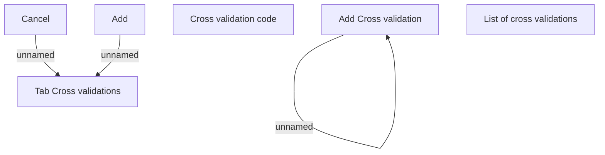

# Tab Cross validations

```mermaid
graph TD
    Cancel["Cancel"]
    Add["Add"]
    Cross_validation_code["Cross validation code"]
    Add_Cross_validation["Add Cross validation"]
    List_of_cross_validations["List of cross validations"]
    Add_Cross_validation["Add Cross validation"]
    Tab_Cross_validations["Tab Cross validations"]
    Cancel -->|unnamed| Tab_Cross_validations
    Add -->|unnamed| Tab_Cross_validations
    Add_Cross_validation -->|unnamed| Add_Cross_validation
```
