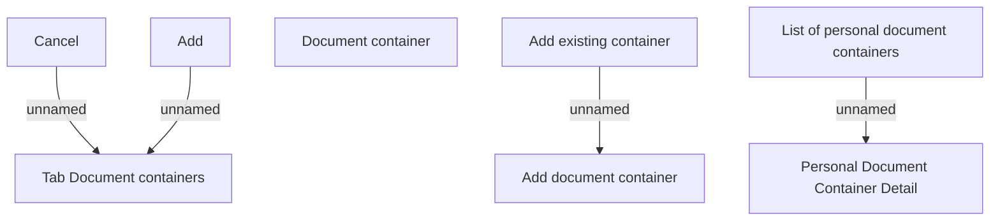

# Tab Document containers

- **Diagram Type**: Custom
- **Package**: HomerSelect/BSL/Analysis Model/Contract Origination/Loan origination configuration /User Interface Model/Subprocess/Subprocess detail/Tab Document containers
- **Diagram ID**: 124336
- **Elements**: 8
- **Connectors**: 4

