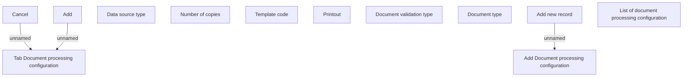

# Tab Document processing configuration

- **Diagram Type**: Custom
- **Package**: HomerSelect/BSL/Analysis Model/Contract Origination/Loan origination configuration /User Interface Model/Subprocess/Subprocess detail/Tab Document processing configuration
- **Diagram ID**: 124337
- **Elements**: 12
- **Connectors**: 3

